# Casino Royale Game - Class Diagram

```mermaid
classDiagram
    %% Interfaces
    class IObject {
        <<interface>>
        +Vector2 Coords
        +Vector2 Velocity
        +bool Destroyed
        +bool HasChanged
    }
    
    class IHitbox {
        <<interface>>
        +Rectangle Hitbox
        +CollidedWith(IHitbox) bool
    }
    
    class IDrawable {
        <<interface>>
        +Texture2D Texture
    }
    
    class IJump {
        <<interface>>
        +bool InJump
        +float InitialJumpVelocity
    }
    
    class INetworkObject {
        <<interface>>
        +uint NetworkObjectId
        +bool HasChanged
        +OnChanged event
    }
    
    class IItemFactory~T~ {
        <<interface>>
        +CreateItem(id, position, velocity) T
        +CreateFromState(ItemState) T
        +GetTexture() Texture2D
        +GetItemType() ItemType
    }

    %% Game Entity Hierarchy
    class GameEntity {
        <<abstract>>
        -Vector2 _coords
        -Vector2 _velocity
        -Rectangle _hitbox
        -float mass
        -bool destroyed
        +Move(dt)
        +AwakenEntity()
        +SleepEntity()
        +DestroyEntity()
        +GetEntityState() GameEntityState
    }
    
    class PlayableCharacter {
        -uint pid
        -string username
        -Texture2D tex
        -float standardSpeed
        -bool inJump
        -float initialJumpVelocity
        +TryMovePlayer(KeyboardState, dt, GameWorld)
        +UpdateJump(bool, GameWorld)
        +GetPlayerState() PlayerState
        +GetUsername() string
        +GetID() uint
    }
    
    class Item {
        <<abstract>>
        -uint itemId
        -ItemType itemType
        -float elasticity
        -float lifetime
        +Update(dt, gameArea, tileRects)
        +Destroy()
        +Collect()
        +GetState() ItemState
        +SetState(ItemState)
    }
    
    class Coin {
        +Collect()
    }
    
    class Sword {
        +Collect()
    }

    %% Game State Hierarchy
    class GameState {
        <<abstract>>
        #Game Game
        #IGameStateManager StateManager
        #SpriteBatch SpriteBatch
        #SpriteFont Font
        #MainCamera MainCamera
        +Initialize()
        +LoadContent()
        +Update(GameTime)
        +Draw(GameTime)
        +Dispose()
    }
    
    class HostGameState {
        -GameWorld GameWorld
        -PlayableCharacter LocalPlayer
        -PlayerIDs _playerIDs
        -string _currentLobbyCode
        +SetLobbyCode(string)
        +GetLobbyCode() string
    }
    
    class ClientGameState {
        -GameWorld GameWorld
        -PlayableCharacter LocalPlayer
        -List~PlayableCharacter~ _otherPlayers
        -string _lobbyCode
        -bool _connected
    }
    
    class MenuGameState {
        +Update(GameTime)
        +Draw(GameTime)
    }

    %% Game Systems
    class GameWorld {
        -Rectangle GameArea
        -Artist artist
        -ItemManager itemManager
        -GridManager gridManager
        +InitializeGameWorld(playerOrigin, gameArea)
        +InitializeGameWorldFromState(JoinAcceptPacket)
        +DrawGameObjects()
        +Update(dt, isHost)
        +SpawnItem(itemType, position, velocity)
        +GetItemStates() ItemState[]
        +GetGridTileStates() GridTileState[]
    }
    
    class ItemManager {
        -Dictionary~ItemType, IItemFactory~ _factories
        -List~Item~ _allItems
        -uint _nextItemId
        +RegisterFactory(ItemType, IItemFactory)
        +SpawnItem(ItemType, position, velocity)
        +UpdateItems(dt, gameArea, tileRects)
        +GetAllItemStates() ItemState[]
        +GetChangedItemStates() ItemState[]
        +RemoveItemById(uint)
    }
    
    class PhysicsSystem {
        <<static>>
        +UpdatePhysics(gameArea, tileRects, coords, velocity, hitbox, mass, dt)
        +EnforceMovementRules(gameArea, tileRects, entity, dt)
        +IsPlayerGrounded(gameArea, tileRects, player) bool
    }
    
    class GridManager {
        -Dictionary~Point, GridTile~ tiles
        -int worldWidth
        -int worldHeight
        -int tileSize
        +PlaceTile(type, hitbox, texture, source, isSolid)
        +GetAllTiles() List~GridTile~
        +GetSolidHitboxes() IEnumerable~Rectangle~
    }
    
    class GridTile {
        +GridTileType Type
        +Rectangle Hitbox
        +Rectangle Source
        +bool IsSolid
        +Texture2D Texture
    }

    %% Factories
    class CoinFactory {
        -Texture2D coinTex
        +CreateItem(id, position, velocity) Item
        +CreateFromState(ItemState) Item
    }
    
    class SwordFactory {
        -Texture2D swordTex
        +CreateItem(id, position, velocity) Item
        +CreateFromState(ItemState) Item
    }

    %% Networking
    class NetworkManager {
        <<singleton>>
        -bool IsHost
        -bool IsClient
        +Initialize(isHost)
        +NotifyObjectChanged(objectId, propertyName, newValue)
        +HostSendJoinAcceptance(...)
        +HostBroadcastPlayerJoined(...)
    }
    
    class NetworkComponent {
        -INetworkObject _owner
        +SubscribeToChanges()
        +HandlePropertyChanged(propertyName, newValue)
    }

    %% Utilities
    class Artist {
        -ContentManager content
        -SpriteBatch spriteBatch
        -MainCamera camera
        +DrawGridTiles(tiles)
        +DrawItems(items)
    }
    
    class MainCamera {
        <<singleton>>
        -Vector2 position
        -float zoom
        +InitMainCamera(Window, player)
        +MoveToFollowPlayer(player)
        +ApplyRatio(ratio)
    }

    %% Relationships - Entity Hierarchy
    IObject <|.. GameEntity
    IHitbox <|.. GameEntity
    INetworkObject <|.. GameEntity
    GameEntity <|-- PlayableCharacter
    GameEntity <|-- Item
    Item <|-- Coin
    Item <|-- Sword
    
    %% Relationships - Interfaces
    IDrawable <|.. PlayableCharacter
    IDrawable <|.. Item
    IJump <|.. PlayableCharacter
    
    %% Relationships - Game State
    GameState <|-- HostGameState
    GameState <|-- ClientGameState
    GameState <|-- MenuGameState
    
    %% Relationships - Composition
    HostGameState o-- GameWorld
    HostGameState o-- PlayableCharacter
    ClientGameState o-- GameWorld
    ClientGameState o-- PlayableCharacter
    
    GameWorld o-- ItemManager
    GameWorld o-- GridManager
    GameWorld o-- Artist
    
    ItemManager o-- CoinFactory
    ItemManager o-- SwordFactory
    ItemManager o-- Item
    
    GridManager o-- GridTile
    
    %% Relationships - Factory Pattern
    IItemFactory <|.. CoinFactory
    IItemFactory <|.. SwordFactory
    CoinFactory ..> Coin : creates
    SwordFactory ..> Sword : creates
    
    %% Relationships - Networking
    GameEntity o-- NetworkComponent
    NetworkComponent --> NetworkManager : uses
    
    %% Relationships - Systems
    GameWorld ..> PhysicsSystem : uses
    PlayableCharacter ..> PhysicsSystem : uses
    Item ..> PhysicsSystem : uses
```

## Key Architecture Patterns

### 1. Entity Component System (Partial)
- **GameEntity** serves as the base class for all game objects
- Implements multiple interfaces (IObject, IHitbox, INetworkObject)
- Uses composition with NetworkComponent for networking

### 2. State Pattern
- **GameState** abstract class with concrete implementations:
  - HostGameState (server/host logic)
  - ClientGameState (client logic)
  - MenuGameState (menu UI)

### 3. Factory Pattern
- **IItemFactory** interface for creating items
- Concrete factories: CoinFactory, SwordFactory
- Managed by ItemManager for centralized item creation

### 4. Singleton Pattern
- **NetworkManager**: Single instance for network operations
- **MainCamera**: Single camera instance for the game

### 5. Observer Pattern
- NetworkComponent subscribes to entity changes
- Event-driven networking updates

## Main Components

### Game Objects
- **GameEntity**: Base class with physics, networking, and lifecycle management
- **PlayableCharacter**: Player with movement, jumping, and input handling
- **Item**: Base class for collectible items (Coin, Sword)

### Game Systems
- **GameWorld**: Main game environment manager
- **PhysicsSystem**: Static physics calculations (gravity, collisions, movement)
- **ItemManager**: Manages all items in the game
- **GridManager**: Tile-based platform management

### Networking
- **NetworkManager**: Coordinates multiplayer communication
- **NetworkComponent**: Handles per-object network synchronization
- Packet-based communication for state updates

### Rendering
- **Artist**: Centralized rendering for game objects
- **MainCamera**: Camera system with player following
